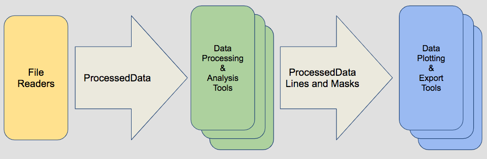

# pyEcholab

pyEcholab is a python package for reading, writing, processing, and plotting data from Simrad/Kongsberg sonar systems.

Water-column echosounder data are becoming increasingly available and are used for a diversity of research objectives. These data are large, complex, and recorded in instrument-specific binary file formats. pyEcholab is an open-source, python-based system for reading, processing, and visualizing water-column echosounder files. Currently, the system handles Simrad .raw files and will be expanded to support others. It has been developed to meet existing processing and visualization needs, allowing efficient large-scale processing and giving non-programmers data access. In addition, its base classes and open architecture provide a framework for developing new processing algorithms and visualization techniques that can be modularized into the system. Through this open-source mechanism, pyEcholab has the ability to continually grow, increase its capabilities, and expand the use of water-column echosounder data by the scientific community.

### Architecture




### Current Classes/Functionalities

&nbsp;&nbsp;**_Base Classes_**  
* PingData: Stores "ping" based data from fisheries sonar systems
* ProcessedData: Stores and manipulates a 2d sample data array along with 1d arrays that define the horizontal and vertical axes of that data. The horizontal axis is defined as 'ping_time' and the vertical axis is 'range' or 'depth'
* RawData: Contains a single channel’s data extracted from a Simrad raw file collected from an EK/ES60 or ES70

&nbsp;&nbsp;**_File Reader Class_**
* EK60: Reads in one or more EK60 files and generates a RawData class instance for each unique channel ID in the files. The class also contains numerous methods used to extract raw sample data or create ProcessedData objects containing transformed data such as Sv.

&nbsp;&nbsp;**_Processing & Analysis Classes_**
* Mask: Creates, manipulates and applies masks to ProcessedData objects
* Line: Implements lines based on ping_time and depth/range values. It provides methods manipulating these values in various ways
* AlignPings: Operates on grouped ProcessedData or RawData objects aligning ping times across objects by either adding blank pings or deleting pings so all objects match the object with the longest or shortest pingtime array

&nbsp;&nbsp;**_Plotting and Export Classes_** 
* EchogramViewer: Uses PyQt to create interactive plot display of data objects. 
* Echogram: Provides basic plotting functions to display data objects using matplotlib

## Getting Started


pyEcholab and its core libraryecholab2 are currently hosted in this GitHub
repository (https://github.com/CI-CMG/PyEcholab) and are not currently 
available from any of the Python package management systems.
Download to your machine by cloning the git repository.

```
mkdir ~/<where_you_want_the_code>
cd ~/<where_you_want_the_code>
git clone https://github.com/CI-CMG/pyEcholab.git
```

### Prerequisites

pyEcholab2 requires Python 2.7 or Python 3.6.x (testing is more complete in the 3.6 evironment). For those not familiar with building Python environments, we recommend using an [Anaconda](https://www.anaconda.com/download/) Python distribution which includes all needed packages except basemap. The following packages are needed If you use your own Python installation: 

&nbsp;&nbsp;**_Required_**
* [matplotlib](https://matplotlib.org/) for plotting echograms.
* [numpy](http://www.numpy.org/) for large, multi-dimensional arrays.
* [pytz](http://pytz.sourceforge.net/) for cross platform timezone calculations.
* [future](https://pypi.org/project/future/) compatibility layer between Python 2 and Python 3.

&nbsp;&nbsp;**_Optional_**
* [PyQT4](https://wiki.python.org/moin/PyQt4) for GUI applications (see [example](https://github.com/CI-CMG/PyEcholab2/blob/master/examples/qt_echogram_viewer.py)).
* [basemap](https://matplotlib.org/basemap/) for plotting on maps (only used in [nmea example](https://github.com/CI-CMG/PyEcholab2/blob/master/examples/nmea_example.py) and currently only works with matplotlib 1.5.0rc3, basemap 1.0.8, and pyproj 1.9.5.1).
* [cartopy](https://scitools.org.uk/cartopy/docs/v0.15/installing.html#installing) for plotting on maps (replacing basemap).

### Installation

Once you have pyEcholab cloned to your machine, you need to tell Python where to find the package. Your Python development environment may provide a way to do this, if not, the following can be used at a bash prompt or added to
your shell initialisation file:

```
export PYTHONPATH=$PYTHONPATH:~/<where_you_want_the_code>
```

### Data
Raw files used by the example scripts need to be downloaded seperately to the examples/data folder before running. They can be downloaded from the NCEI FTP server: *ftp://ftp.ngdc.noaa.gov/pub/outgoing/mgg/wcd/pyEcholab_data/examples/*  
  
On Unix based systems, this can easily achieved as follows:

```
cd ~/<where_you_want_the_code>/examples/data
make
```

### Examples
Numerous example files are provided to introduce users to pyEcholab. These examples exist as both Python scripts and Jupyter Notebooks. The examples are heavily commented to explain each step.

## Getting Involved
The pyEcholab project is designed to encourage members of the acoustic community to contribute back to the project. The basic architecture and use of standardized ProcessedData, Mask and Line objects provide a "plug and play" framework for the development of additional processing, analysis, plotting and export modules. Please contact the pyEcholab team at [wcd.info@noaa.gov](mailto:wcd.info@noaa.gov) for more information.

## Authors

* **Rick Towler** - _NOAA/NMFS, Alaska Fisheries Science Center_
* **Charles Anderson** - _Cooperative Institute for Research in Environmental Sciences (CIRES) located at  
NOAA's National Centers for Environmental Information (NCEI)_
* **Veronica Martinez** - _CIRES located at NCEI_
* **Pamme Crandall** - _CIRES located at NCEI_

## License

This software is licensed under the MIT License - see the
[LICENSE](LICENSE) file for details

## Acknowledgments

* This work was funded by the National Marine Fisheries Service Office of Science and Technology.

## Contact
[wcd.info@noaa.gov](mailto:wcd.info@noaa.gov)